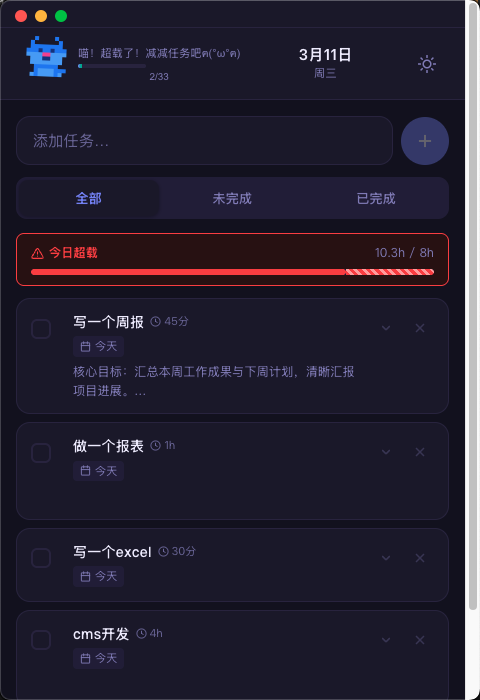
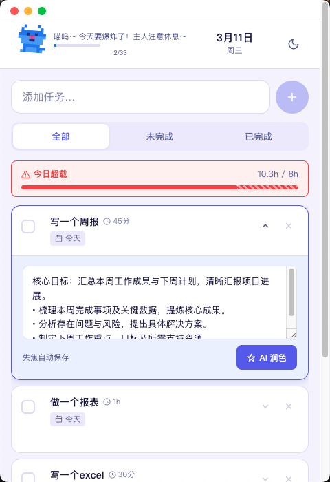

# DailyTask

一个可爱的 Mac 桌面待办事项应用，带有像素小猫陪伴你完成每一项任务。


## 截图

<p align="center">
  
  &nbsp;&nbsp;
  
</p>

## 功能

- **AI 自动生成任务内容** — 输入标题后自动展开执行步骤，无需手动填写
- **AI 时间估算** — 自动估算每个任务耗时，汇总今日工作量
- **工作量看板** — 实时显示今日负载，超过 8h 高亮预警
- **像素小猫** — 完成任务获得经验，小猫随之成长升级
- **历史记录** — 点击小猫查看历史完成记录（按日期分组）
- **深色 / 浅色模式** — 一键切换，自动跟随偏好
- **AI 润色** — 对任务内容进行结构化润色优化

## 下载

前往 [Releases](https://github.com/fq393/dailytask/releases) 下载最新版本：

| 平台 | 文件 |
|------|------|
| macOS (Apple Silicon) | `DailyTask-x.x.x-arm64.dmg` |
| Windows | `DailyTask-Setup-x.x.x.exe` |

> **macOS 注意**：应用未签名，首次打开需右键 → 打开，或在「系统设置 → 隐私与安全性」中允许。

## 开发

```bash
npm install
npm run dev          # 开发模式
npm run electron:build  # 本地构建
npm run release      # 版本发布（bump + push tag，触发 CI 自动构建）
```

## 技术栈

Electron 41 · React 19 · TypeScript · Vite

## License

MIT
